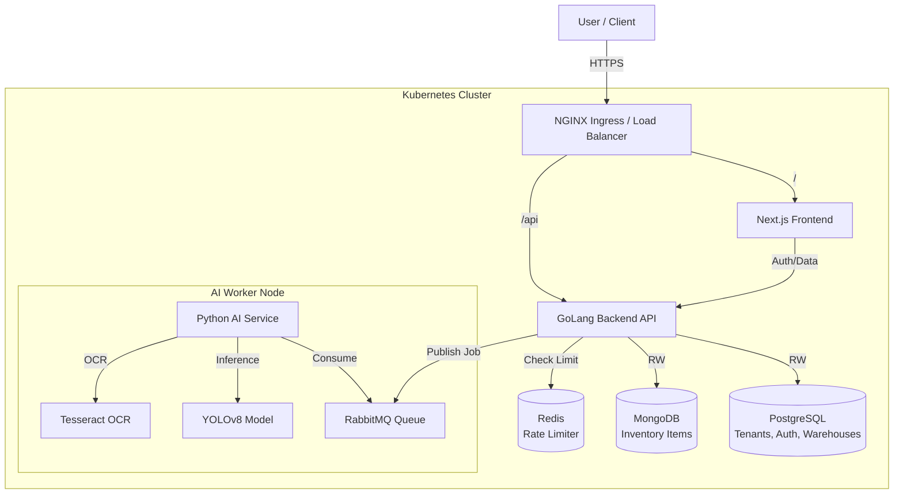
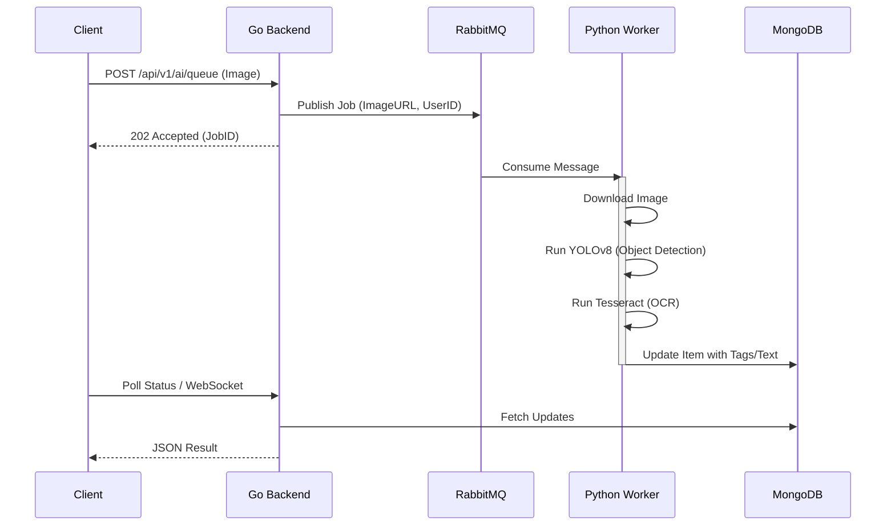
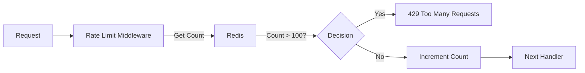

# System Architecture

## High-Level Overview

```mermaid
graph TD
    User[User / Client] -->|HTTPS| Ingress[NGINX Ingress / Load Balancer]
    
    subgraph K8s_Cluster [Kubernetes Cluster]
        Ingress -->|/| Frontend[Next.js Frontend]
        Ingress -->|/api| Backend[GoLang Backend API]
        
        Frontend -->|Auth/Data| Backend
        
        Backend -->|RW| Postgres[(PostgreSQL\nTenants, Auth, Warehouses)]
        Backend -->|RW| Mongo[(MongoDB\nInventory Items)]
        Backend -->|Check Limit| Redis[(Redis\nRate Limiter)]
        
        Backend -->|Publish Job| RabbitMQ[RabbitMQ Queue]
        
        subgraph AI_Node [AI Worker Node]
            Worker[Python AI Service] -->|Consume| RabbitMQ
            Worker -->|Inference| YOLO[YOLOv8 Model]
            Worker -->|OCR| Tesseract[Tesseract OCR]
        end
    end
```

## AI Processing Pipeline

This flow details how an image is processed from upload to structured data.

```mermaid
sequenceDiagram
    participant C as Client
    participant API as Go Backend
    participant Q as RabbitMQ
    participant AI as Python Worker
    participant DB as MongoDB

    C->>API: POST /api/v1/ai/queue (Image)
    API->>Q: Publish Job (ImageURL, UserID)
    API-->>C: 202 Accepted (JobID)
    
    Q->>AI: Consume Message
    activate AI
    AI->>AI: Download Image
    AI->>AI: Run YOLOv8 (Object Detection)
    AI->>AI: Run Tesseract (OCR)
    AI->>DB: Update Item with Tags/Text
    deactivate AI
    
    C->>API: Poll Status / WebSocket
    API->>DB: Fetch Updates
    API-->>C: JSON Result
```

## Rate Limiting Strategy

```mermaid
flowchart LR
    Request --> Middleware[Rate Limit Middleware]
    Middleware -->|Get Count| Redis
    Redis -->|Count > 100?| Decision{Decision}
    Decision -- Yes --> Reject[429 Too Many Requests]
    Decision -- No --> Incr[Increment Count]
    Incr --> Proceed[Next Handler]
```
